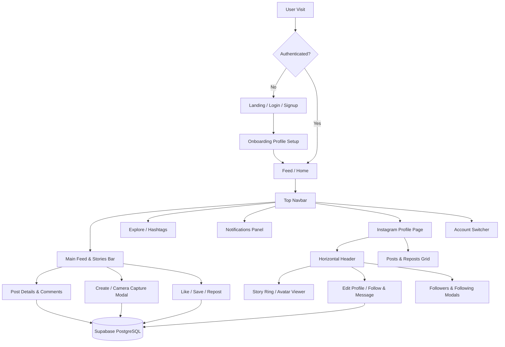

<div align="center">

# 🚀 Techmon

**A Modern, Developer-Centric Social Platform**

[](https://nextjs.org/)
[](https://react.dev/)
[](https://www.typescriptlang.org/)
[](https://tailwindcss.com/)
[](https://supabase.com/)
[](LICENSE)

<p align="center">
  <a href="#-features">Features</a> •
  <a href="#-tech-stack">Tech Stack</a> •
  <a href="#-architecture--user-flow">Architecture</a> •
  <a href="#-project-structure">Structure</a> •
  <a href="#-database-schema">Database SQL</a> •
  <a href="#-getting-started">Getting Started</a>
</p>

</div>

---

## 📖 Overview

> [!NOTE]
> **Techmon** combines modern social media dynamics (Instagram-style horizontal profile layouts, 24h stories, rich post feeds, hashtags) with developer-first portfolio elements (skills tagging, GitHub/LinkedIn links, code sharing, multi-account switcher).

---

## ✨ Features

### 👤 Instagram-Style Horizontal Profile Layout
- **150px Avatar** with active story ring indicator (gradient border when new stories exist).
- **Row 1**: Name, Edit Profile / Follow & Message buttons, and dropdown action menu (≡).
- **Row 2**: Horizontal stats count (*Posts*, *Followers*, *Following*) with interactive list modals.
- **Row 3**: Headline, Organization, Bio, Social Links (GitHub, LinkedIn, Portfolio), and Skills badges.
- **Responsive**: Smoothly transitions to vertical stacking on mobile viewports.

### 📸 24h Stories & Camera Capture
- Post ephemeral image or text stories that automatically expire in 24 hours.
- Built-in **Webcam Camera Capture Modal** for snapping and uploading photos directly inside the app.
- Interactive fullscreen **Story Viewer** with progress bars and story view tracking.

### 📝 Rich Social Feed & Interactions
- Full CRUD capabilities for posts (Text, Code Snippets, Images).
- **Reposting System**: Share existing posts to your own feed.
- **Comments & Likes**: Multi-level commenting, real-time likes modal, and saved posts/bookmarks collection.
- **Post Archiving**: Archive posts from your profile without deleting them permanently.

### 🏷️ Hashtags & Real-Time Search
- Automatic regex parsing for `#hashtags` with interactive clickable tags.
- Dedicated `/hashtag/[tag]` feed pages.
- Sidebar **Trending Hashtags** and **Suggested Users** widgets.
- Global instant **Search Modal** for finding users and content.

### 👥 Multi-Account Switcher
- Switch seamlessly between multiple logged-in accounts without clearing your active state.

---

## 🛠️ Tech Stack

| Technology | Role |
| :--- | :--- |
| **[Next.js 16](https://nextjs.org/)** | App Router, React Server Components & Turbopack |
| **[React 19](https://react.dev/)** | Frontend UI & Hooks |
| **[Tailwind CSS v4](https://tailwindcss.com/)** | Utility-first styling & Responsive design system |
| **[Supabase](https://supabase.com/)** | PostgreSQL Database, Authentication & Row Level Security |
| **[Lucide React](https://lucide.dev/)** | Modern vector icon set |
| **[TypeScript](https://www.typescriptlang.org/)** | Strict type definitions |

---

## 📊 Architecture & User Flow



---

## 📁 Project Structure

```text
techmon/
├── app/                      # Next.js App Router Pages
│   ├── activity/            # User activity log
│   ├── archive/             # Archived posts
│   ├── feed/                # Main home social feed
│   ├── hashtag/[tag]/       # Hashtag detail feed page
│   ├── login/               # Authentication login
│   ├── onboarding/          # Profile onboarding flow
│   ├── post/[id]/           # Post permalink detail page
│   ├── profile/             # Profile page ([id]/page.tsx) & edit page
│   ├── signup/              # Account registration
│   ├── globals.css          # Global CSS & Tailwind configuration
│   ├── layout.tsx           # Main Root Layout
│   └── page.tsx             # Root Page redirect
│
├── components/               # React UI Components & Modals
│   ├── AppLayoutWrapper.tsx # Global layout container
│   ├── CameraCaptureModal.tsx # Webcam/Camera photo capture modal
│   ├── CommentItem.tsx       # Individual comment view
│   ├── CreatePostModal.tsx   # New post creation modal
│   ├── EditPostModal.tsx     # Post editor modal
│   ├── FollowListModal.tsx   # Followers / Following list modal
│   ├── HashtagText.tsx       # Auto-linked hashtag parser component
│   ├── LikesModal.tsx        # Modal showing users who liked a post
│   ├── MiniProfileCard.tsx   # Compact profile summary card
│   ├── NotificationsPanel.tsx # Notifications overlay
│   ├── PostDetailModal.tsx   # Post modal viewer
│   ├── PostDetailView.tsx    # Full post detail view
│   ├── PostGrid.tsx          # User posts & reposts grid
│   ├── SaveButton.tsx        # Bookmarking/Saving component
│   ├── SearchModal.tsx       # Real-time search modal
│   ├── SharePostModal.tsx    # Post sharing options modal
│   ├── SkillsAutocomplete.tsx# Skills tag input autocomplete
│   ├── StoriesBar.tsx        # Ephemeral stories horizontal bar
│   ├── StoryViewer.tsx       # Fullscreen story player
│   ├── SuggestedUsers.tsx    # Suggested profiles sidebar widget
│   ├── SwitchAccountModal.tsx# Multi-account switcher modal
│   ├── ThreeColumnLayout.tsx # Standard 3-column app view
│   ├── TopNavbar.tsx         # Global navigation bar
│   └── TrendingHashtags.tsx  # Trending tags sidebar widget
│
├── lib/                      # Utilities, Helpers & Types
│   ├── accountManager.ts    # Multi-account local storage helper
│   ├── hashtagHelpers.ts    # Regex hashtag extractor utilities
│   ├── supabase.ts         # Supabase client configuration
│   └── types.ts             # TypeScript definitions
│
├── public/                   # Static public assets
├── package.json              # Dependencies & Scripts
├── next.config.ts            # Next.js configuration
├── tsconfig.json             # TypeScript configuration
└── README.md                 # Project Documentation
```

---

## 🗄️ Database Schema Setup

<details>
<summary><b>Click to expand SQL Schema Setup for Supabase</b></summary>

```sql
-- Profiles table
CREATE TABLE profiles (
  id UUID REFERENCES auth.users ON DELETE CASCADE PRIMARY KEY,
  name TEXT NOT NULL,
  headline TEXT,
  organization TEXT,
  bio TEXT,
  avatar_url TEXT,
  github_url TEXT,
  linkedin_url TEXT,
  portfolio_url TEXT,
  skills TEXT[] DEFAULT '{}',
  updated_at TIMESTAMP WITH TIME ZONE DEFAULT timezone('utc'::text, now()) NOT NULL
);

-- Posts table
CREATE TABLE posts (
  id UUID DEFAULT gen_random_uuid() PRIMARY KEY,
  user_id UUID REFERENCES profiles(id) ON DELETE CASCADE NOT NULL,
  type TEXT DEFAULT 'post' CHECK (type IN ('post', 'repost')),
  content TEXT,
  image_url TEXT,
  shared_post_id UUID REFERENCES posts(id) ON DELETE CASCADE,
  archived BOOLEAN DEFAULT false,
  created_at TIMESTAMP WITH TIME ZONE DEFAULT timezone('utc'::text, now()) NOT NULL
);

-- Comments table
CREATE TABLE comments (
  id UUID DEFAULT gen_random_uuid() PRIMARY KEY,
  post_id UUID REFERENCES posts(id) ON DELETE CASCADE NOT NULL,
  user_id UUID REFERENCES profiles(id) ON DELETE CASCADE NOT NULL,
  content TEXT NOT NULL,
  created_at TIMESTAMP WITH TIME ZONE DEFAULT timezone('utc'::text, now()) NOT NULL
);

-- Likes table
CREATE TABLE likes (
  id UUID DEFAULT gen_random_uuid() PRIMARY KEY,
  post_id UUID REFERENCES posts(id) ON DELETE CASCADE NOT NULL,
  user_id UUID REFERENCES profiles(id) ON DELETE CASCADE NOT NULL,
  created_at TIMESTAMP WITH TIME ZONE DEFAULT timezone('utc'::text, now()) NOT NULL,
  UNIQUE(post_id, user_id)
);

-- Follows table
CREATE TABLE follows (
  id UUID DEFAULT gen_random_uuid() PRIMARY KEY,
  follower_id UUID REFERENCES profiles(id) ON DELETE CASCADE NOT NULL,
  following_id UUID REFERENCES profiles(id) ON DELETE CASCADE NOT NULL,
  created_at TIMESTAMP WITH TIME ZONE DEFAULT timezone('utc'::text, now()) NOT NULL,
  UNIQUE(follower_id, following_id)
);

-- Saved Posts table
CREATE TABLE saved_posts (
  id UUID DEFAULT gen_random_uuid() PRIMARY KEY,
  user_id UUID REFERENCES profiles(id) ON DELETE CASCADE NOT NULL,
  post_id UUID REFERENCES posts(id) ON DELETE CASCADE NOT NULL,
  collection_id TEXT DEFAULT 'default',
  created_at TIMESTAMP WITH TIME ZONE DEFAULT timezone('utc'::text, now()) NOT NULL,
  UNIQUE(user_id, post_id)
);

-- Stories table
CREATE TABLE stories (
  id UUID DEFAULT gen_random_uuid() PRIMARY KEY,
  user_id UUID REFERENCES profiles(id) ON DELETE CASCADE NOT NULL,
  media_url TEXT,
  text_content TEXT,
  created_at TIMESTAMP WITH TIME ZONE DEFAULT timezone('utc'::text, now()) NOT NULL,
  expires_at TIMESTAMP WITH TIME ZONE NOT NULL
);

-- Story Views table
CREATE TABLE story_views (
  id UUID DEFAULT gen_random_uuid() PRIMARY KEY,
  story_id UUID REFERENCES stories(id) ON DELETE CASCADE NOT NULL,
  viewer_id UUID REFERENCES profiles(id) ON DELETE CASCADE NOT NULL,
  created_at TIMESTAMP WITH TIME ZONE DEFAULT timezone('utc'::text, now()) NOT NULL,
  UNIQUE(story_id, viewer_id)
);

-- Notifications table
CREATE TABLE notifications (
  id UUID DEFAULT gen_random_uuid() PRIMARY KEY,
  recipient_id UUID REFERENCES profiles(id) ON DELETE CASCADE NOT NULL,
  actor_id UUID REFERENCES profiles(id) ON DELETE CASCADE NOT NULL,
  type TEXT NOT NULL CHECK (type IN ('like', 'comment', 'follow', 'repost')),
  post_id UUID REFERENCES posts(id) ON DELETE CASCADE,
  read BOOLEAN DEFAULT false,
  created_at TIMESTAMP WITH TIME ZONE DEFAULT timezone('utc'::text, now()) NOT NULL
);
```
</details>

---

## 🚦 Getting Started

> [!IMPORTANT]
> Make sure you have **Node.js 18+** installed and an active **Supabase** project.

### 1. Clone the repository
```bash
git clone https://github.com/your-username/techmon.git
cd techmon
```

### 2. Configure Environment Variables
Create a `.env.local` file in the root directory:
```env
NEXT_PUBLIC_SUPABASE_URL=https://your-supabase-project.supabase.co
NEXT_PUBLIC_SUPABASE_ANON_KEY=your-supabase-anon-key
```

### 3. Install Dependencies
```bash
npm install
```

### 4. Run Development Server
```bash
npm run dev
```

Navigate to [http://localhost:3000](http://localhost:3000) to view Techmon in action!

---

## 📜 Available Scripts

- `npm run dev` – Launch development server with Turbopack fast-refresh
- `npm run build` – Build optimized production bundle
- `npm run start` – Start production server
- `npm run lint` – Run ESLint diagnostics

---

## 📄 License

This project is licensed under the **MIT License** - see the [LICENSE](LICENSE) file for details.

<div align="center">
  <sub>Built with ❤️ for developers by the Techmon Team</sub>
</div>
