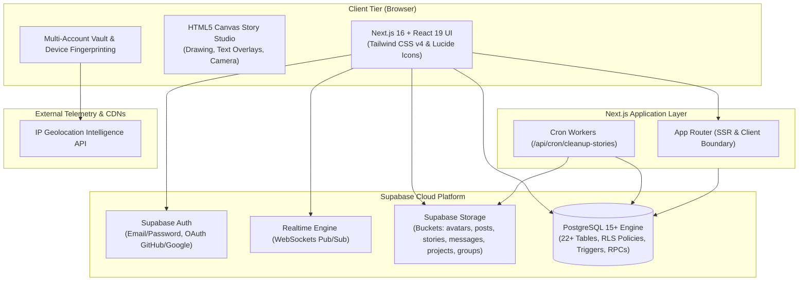

<div align="center">

  

  # TECHMON

  ### **The Network for People Who Build**
  *A high-performance social ecosystem, developer portfolio hub, and career discovery platform crafted for engineers, tech students, and creators.*

  <br />

  [-000000?style=for-the-badge&logo=next.js&logoColor=white)](https://nextjs.org/)
  [](https://react.dev/)
  [](https://www.typescriptlang.org/)
  [](https://tailwindcss.com/)
  [](https://supabase.com/)
  [](https://www.postgresql.org/)
  [](https://vercel.com/)
  [](LICENSE)

  <br />

  [Explore Features](#-feature-matrix) • [Tech Stack](#-technology-stack) • [System Architecture](#-system-architecture) • [Database Design](#-database-schema--security) • [Quick Start](#-quick-start)

</div>

---

## 📌 Executive Summary

**Techmon** reimagines professional and social networking for the engineering community. Traditional platforms force developers to compartmentalize: code repositories live on GitHub, polished resumes live on LinkedIn, and creative visual updates live on Instagram or X. 

**Techmon bridges these worlds into a unified, real-time developer ecosystem.** Engineers can share syntax-highlighted code snippets and interactive project demos, stream live webcam stories with custom canvas annotations, collaborate in real-time WebSockets direct messaging, join developer communities, track suspicious logins with IP geolocation intelligence, and recruit or apply for tech roles using a built-in Applicant Tracking System (ATS).

---

## 💎 Key Engineering Highlights

Built with modern engineering standards to demonstrate production-grade software craftsmanship:

- ⚡ **Cutting-Edge Stack**: Powered by **Next.js 16 (App Router)** and **React 19**, taking advantage of server/client component boundaries, React streaming, and optimistic mutations.
- 🛡️ **Zero-Trust Database Security**: 100% of tables are fortified with **PostgreSQL Row-Level Security (RLS)**, ensuring data access logic is validated directly at the database engine level.
- 🔄 **Real-Time WebSocket Sync**: Realtime data channels for direct messaging, read receipts, and live notification counts without client polling.
- 🎨 **In-Browser Media & Canvas Engine**: Zero-external-dependency live camera capture tool with custom HTML5 Canvas drawing, font engines, and sticker overlays.
- 👥 **Multi-Session Account Switcher**: Instagram-style instant multi-account switching managed via secure persistent local session tokens.
- 🕵️ **Intelligent Anomaly Detection**: Automatic session telemetry analyzing client IP, device fingerprinting, user-agent parsing, and real-time security alerts.
- 🧹 **Self-Cleaning Storage Lifecycle**: Automated cron workers and PL/pgSQL database triggers executing media garbage collection for expired ephemeral stories.

---

## 🏛️ System Architecture


```mermaid
flowchart TB
    subgraph Client["Client Tier (Browser)"]
        UI["Next.js 16 + React 19 UI<br/>(Tailwind CSS v4 & Lucide Icons)"]
        CanvasEngine["HTML5 Canvas Story Studio<br/>(Drawing, Text Overlays, Camera)"]
        SessionMgr["Multi-Account Vault & Device Fingerprinting"]
    end

    subgraph AppServer["Next.js Application Layer"]
        AppRouter["App Router (SSR & Client Boundary)"]
        ApiCron["Cron Workers (/api/cron/cleanup-stories)"]
    end

    subgraph SupabasePlatform["Supabase Cloud Platform"]
        AuthService["Supabase Auth<br/>(Email/Password, OAuth GitHub/Google)"]
        RealtimeEngine["Realtime Engine (WebSockets Pub/Sub)"]
        StorageEngine["Supabase Storage<br/>(Buckets: avatars, posts, stories, messages, projects, groups)"]
        PostgresDB[("PostgreSQL 15+ Engine<br/>(22+ Tables, RLS Policies, Triggers, RPCs)")]
    end

    subgraph ExternalServices["External Telemetry & CDNs"]
        IPApi["IP Geolocation Intelligence API"]
    end

    UI --> AppRouter
    UI --> AuthService
    UI --> RealtimeEngine
    UI --> StorageEngine
    UI --> PostgresDB
    SessionMgr --> IPApi
    AppServer --> PostgresDB
    ApiCron --> PostgresDB
    ApiCron --> StorageEngine
```

---

## 🚀 Feature Matrix

### 1. 📰 Interactive Feed & Multi-Format Content Engine
* **5 Distinct Post Archetypes**:
  * 💻 **Code Posts**: Code snippets with syntax highlighting, language selector, and copy utility.
  * 📝 **Developer Notes**: Vibrant, customizable gradient backdrops for quick thoughts and micro-announcements.
  * 🖼️ **Rich Media**: High-definition image and video uploads powered by CDN storage.
  * 💬 **Text Posts**: Clean markdown-ready longform or shortform developer posts.
  * 🔁 **Quote & Direct Reposts**: Share fellow developers' posts into your feed with your own commentary.
* **Hashtag Discovery Engine**: Automatic `#hashtag` extraction, clickable tags, and dedicated hashtag feed aggregation (`/hashtag/[tag]`).
* **Feed Modes**: Personalized **Following Feed** (curated posts from followed builders) and global **Explore Feed** (`/feed`).
* **Post Archival**: Ability to archive posts without permanently deleting engagement history.

### 2. 📸 Ephemeral Stories Studio & Camera Capture
* **Live Webcam & Device Capture**: Direct access to user webcam/camera with countdown timer, front/back switching, and zoom controls.
* **Interactive Canvas Annotation Suite**:
  * **Freehand Drawing**: HTML5 Canvas drawing tool with stroke smoothing, color palette picker, and undo history.
  * **Draggable Text Overlays**: Drag-and-drop text placements with 4 custom typography modes (*Classic, Bold, Modern, Typewriter*).
* **Automated 24-Hour Expiration**: Ephemeral stories automatically expire after 24 hours.
* **Profile Story Highlights**: Pin best stories into permanent, custom-titled highlight reels with cover previews on user profiles.
* **Viewer Analytics**: Real-time story view counts with chronological viewer inspection.

### 3. 💬 Real-Time Direct Messaging (DMs)
* **WebSocket Realtime Messaging**: Instant message delivery with sub-100ms latency via Supabase Realtime publications.
* **Rich Attachments**:
  * Photos, videos, and multi-format files with download capabilities.
  * **In-Chat Audio Notes**: Voice recording and playback.
  * **Interactive Polls**: Live vote casting with real-time percentage counters.
  * **Quick Camera Capture**: Snap and send stories or media directly inside the active chat.
* **Conversation Management**: Message unread badges, read status indicators, quoted reply threads, and message unsending.

### 4. 💼 Developer Portfolio & Career Hub (Mini-ATS)
* **Portfolio Showcase**:
  * Showcase projects with repository links (GitHub), live production URLs, screenshot previews, and categorized tech-stack pills.
* **Tech Job & Internship Board (`/jobs`)**:
  * Browse roles by **Job Type** (*Full-time, Part-time, Internship, Contract*) and **Work Mode** (*Remote, Hybrid, Onsite*).
  * Filter by tech tags, salary range, and company.
* **Applicant Tracking System (ATS)**:
  * **1-Click Application**: Applicants submit with their verified Techmon profile, resume link, and tailored pitch note.
  * **Employer Review Dashboard**: Job posters can view incoming applicants, evaluate profiles, read pitches, and directly trigger messaging.

### 5. 👥 Developer Communities & Channels (`/groups`)
* **Public & Private Groups**: Create niche developer circles (e.g., *Frontend Guild, Rustacean Hub, AI Researchers*).
* **Role-Based Access Control (RBAC)**: Distinct permissions for `Admin`, `Moderator`, and `Member`.
* **Group Discussion Streams**: Dedicated group-only feeds for questions, code reviews, and community announcements.

### 6. 🛡️ Enterprise-Grade Security & Session Intelligence
* **Multi-Factor Session Telemetry**:
  * Automated logging of user device types (*Desktop, Mobile, Tablet*), browser engines, operating systems, and exact IP addresses.
  * Reverse geolocation lookup (*City, Region, Country*) via IP intelligence.
  * Real-time in-app security alert notifications on unrecognized device logins.
* **Instant Multi-Account Quick Switcher**:
  * Securely cache and switch between multiple developer identities or test accounts with one click without re-authenticating.

### 7. 🛠️ Moderation Suite & Admin Telemetry (`/admin`)
* **Live System Metrics**: Real-time platform KPI telemetry (Total users, 7-day signups, post creation volume, active reports).
* **Content & User Moderation**:
  * Search, inspect, ban, and unban suspicious accounts.
  * Admin-level post deletion across all content formats.
* **Report Resolution Queue**: Workflow to review user-flagged posts, comments, or accounts with `pending`, `reviewed`, and `dismissed` states.

---

## 💻 Technology Stack

| Domain | Technology | Purpose |
| :--- | :--- | :--- |
| **Framework** | **Next.js 16 (App Router)** | Full-stack architecture, SSR, dynamic routing, and API endpoints |
| **UI Library** | **React 19** | Concurrent rendering, modern hooks, component lifecycle |
| **Language** | **TypeScript 5** | Strict static typing, end-to-end type safety |
| **Styling** | **Tailwind CSS v4** | Modern CSS token system, editorial typography, dark/light aesthetics |
| **Icons** | **Lucide React** | Clean, accessible SVG iconography |
| **Database** | **PostgreSQL 15+** | Relational data store, indexes, foreign key constraints |
| **Backend as a Service** | **Supabase** | Auth, PostgreSQL database, Realtime engine, and Object Storage |
| **Security & Auth** | **Supabase Auth + RLS** | JWT sessions, OAuth providers (GitHub, Google), Row-Level Security |
| **Realtime** | **Supabase Realtime** | WebSockets subscriptions for live messages and notifications |
| **File Storage** | **Supabase Storage** | Buckets: `avatars`, `posts`, `stories`, `messages`, `projects`, `groups` |
| **Geolocation** | **ipapi.co** | Security auditing, IP resolution, and location tracking |
| **Deployment** | **Vercel** | Serverless hosting, Edge CDN delivery, automated cron triggers |

---

## 🗄️ Database Schema & Security

The platform's relational architecture is codified in [`supabase/migrations.sql`](techmon/supabase/migrations.sql), featuring **22+ relational tables**, custom PL/pgSQL functions, triggers, and Row Level Security:

```
┌─────────────────┐       ┌─────────────────┐       ┌─────────────────┐
│    profiles     │──────<│      posts      │──────<│    comments     │
└─────────────────┘       └─────────────────┘       └─────────────────┘
         │                         │                         │
         ├─────────┐               ├─────────┐               └─> comment_likes
         │         ▼               │         ▼
         │   ┌───────────┐         │   ┌───────────┐
         │   │  follows  │         │   │   likes   │
         │   └───────────┘         │   └───────────┘
         │                         │
         ├─────────────────────────┼─────────────────────────┐
         ▼                         ▼                         ▼
   ┌───────────┐             ┌───────────┐             ┌───────────┐
   │  stories  │             │ saved_post│             │post_hasht │
   └───────────┘             └───────────┘             └───────────┘
         │                         │                         │
         ▼                         ▼                         ▼
   ┌───────────┐             ┌───────────┐             ┌───────────┐
   │highlights │             │collections│             │ hashtags  │
   └───────────┘             └───────────┘             └───────────┘
```

<details>
<summary><b>Detailed Table Directory (Click to expand)</b></summary>

| Table Name | Primary Function | Security Model |
| :--- | :--- | :--- |
| `profiles` | User profiles, bio, headlines, skills array, admin & ban flags | Public read; Owner write |
| `posts` | Posts (text, code, media, note, repost), archive states | Public read; Author/Admin write |
| `follows` | Follower / Following graph relationships | Public read; Authenticated write |
| `likes` | Post likes with composite unique constraint `(post_id, user_id)` | Public read; User toggle |
| `comments` | Threaded discussion comments (`parent_comment_id`) | Public read; Author/Admin write |
| `comment_likes` | Individual comment likes | Public read; User toggle |
| `stories` | Ephemeral stories with `expires_at` timestamps | Active stories public; Owner delete |
| `story_views` | Story view telemetry and viewer lists | Author/Viewer read; User insert |
| `highlights` | Story highlight reels pinned to profiles | Public read; Owner write |
| `highlight_stories`| Junction table connecting stories to highlight containers | Public read; Highlight owner write |
| `conversations` | 1-on-1 direct messaging conversation threads | Participants only |
| `messages` | Direct chat messages, media payloads, replies, unsend status | Participants only |
| `notifications` | System notifications (likes, comments, follows, security) | Recipient only |
| `login_history` | Security logs (IP, browser, OS, city, region, device) | Account owner only |
| `projects` | Developer portfolio items, tech stack arrays, repo links | Public read; Owner write |
| `job_listings` | Job and internship opportunities with job type & mode | Public read; Recruiter write |
| `job_applications`| Job applications linking applicant profile to listing | Applicant & Poster only |
| `groups` | Developer communities (public/private) | Public or Member read; Admin write |
| `group_members` | Group memberships with roles (`admin`, `moderator`, `member`)| Public read; RBAC write |
| `group_posts` | Content published within groups | Group member read; Member write |
| `hashtags` | Indexed `#tags` across the platform | Public read; Authenticated write |
| `post_hashtags` | Many-to-many junction table between posts and hashtags | Public read; Author write |
| `reports` | Moderation flags for posts, comments, and users | Reporter insert; Admin read/manage |

</details>

---

## 📂 Project Directory Structure

```text
techmon/
├── app/                              # Next.js 16 App Router Routes
│   ├── activity/                     # Notifications & user interaction history
│   ├── admin/                        # Admin analytics & moderation dashboard
│   ├── api/cron/cleanup-stories/     # Vercel Cron worker for story garbage collection
│   ├── archive/                      # Archived user posts & story vault
│   ├── auth/                         # OAuth redirect handlers
│   ├── feed/                         # Global developer discovery feed
│   ├── forgot-password/              # Password recovery flow
│   ├── groups/                       # Developer communities & channels
│   ├── hashtag/[tag]/                # Tag-filtered post discovery
│   ├── jobs/                         # Job & Internship board + ATS
│   ├── login/                        # Authentication login view
│   ├── login-activity/               # Security dashboard & device sessions
│   ├── messages/                     # Real-time WebSocket messaging interface
│   ├── onboarding/                   # New user setup flow
│   ├── post/[id]/                    # Deep-linked post view with threaded comments
│   ├── profile/[username]/           # Developer profile, portfolio, & highlights
│   ├── reset-password/               # Password update view
│   ├── settings/                     # Account & profile preferences
│   ├── signup/                       # User registration view
│   ├── globals.css                   # Tailwind CSS v4 design tokens & theme
│   ├── layout.tsx                    # Root layout with session & navigation providers
│   └── page.tsx                      # Landing page & personalized following feed
├── components/                       # Modular UI Components (35+ Components)
│   ├── CameraCaptureModal.tsx        # In-browser webcam, drawing canvas, & text overlay
│   ├── PostGrid.tsx                  # Responsive media, note, & code post feed
│   ├── PostDetailView.tsx            # Threaded comments, likes modal, & share controls
│   ├── TopNavbar.tsx                 # Navigation bar, notifications badge, search modal
│   ├── ThreeColumnLayout.tsx         # Classic 3-column desktop layout
│   ├── JobListingModal.tsx           # Job posting creation modal
│   ├── JobApplicantsModal.tsx        # ATS applicant evaluation drawer
│   ├── ProjectModal.tsx              # Portfolio project editor
│   ├── StoriesBar.tsx                # Ephemeral stories avatar bar
│   ├── StoryViewer.tsx               # Full-screen story playback modal
│   ├── SwitchAccountModal.tsx        # Multi-account session switcher
│   └── TrendingHashtags.tsx          # Real-time trending topic pills
├── lib/                              # Core Utilities & State Management
│   ├── accountManager.ts             # Multi-session local storage vault
│   ├── hashtagHelpers.ts             # Regex parser & extractor for hashtags
│   ├── logLogin.ts                   # User-agent parser & IP geolocation intelligence
│   ├── supabase.ts                   # Supabase client initialization
│   └── types.ts                      # TypeScript schemas and application types
├── public/                           # Static assets, vector logos, & branding
└── supabase/
    └── migrations.sql                # Consolidated database DDL, RLS, triggers & storage
```

---

## ⚡ Quick Start

### Prerequisites
* **Node.js**: `18.x` or higher (Node 20+ recommended)
* **Package Manager**: `npm`, `pnpm`, or `yarn`
* **Database**: Free tier [Supabase](https://supabase.com/) project

### 1. Clone the Repository
```bash
git clone https://github.com/your-username/techmon.git
cd techmon/techmon
```

### 2. Install Dependencies
```bash
npm install
```

### 3. Configure Environment Variables
Create a `.env.local` file in the `techmon` root directory:
```env
NEXT_PUBLIC_SUPABASE_URL=https://your-project-id.supabase.co
NEXT_PUBLIC_SUPABASE_ANON_KEY=your-supabase-anon-key
```

### 4. Apply Database Migrations
All 22+ tables, RLS policies, storage buckets, triggers, and RPC procedures are packaged into a single migration file:
1. Go to your **Supabase Dashboard** -> **SQL Editor**.
2. Open [`supabase/migrations.sql`](techmon/supabase/migrations.sql).
3. Paste the contents into the SQL Editor and click **Run**.

### 5. Launch Development Server
```bash
npm run dev
```
Open [http://localhost:3000](http://localhost:3000) in your browser.

---

## 💡 What Makes Techmon Unique for Recruiters?

When evaluating full-stack engineering candidates, Techmon demonstrates comprehensive competency across:

1. **Full-Stack Proficiency**: Not just simple CRUD, but a multifaceted product with real-time sockets, client-side canvas manipulation, audio/video handling, and complex SQL joins.
2. **Database & Security Architecture**: Deep understanding of PostgreSQL performance, relational modeling, foreign key cascades, and declarative Row-Level Security (RLS).
3. **Product & UX Intuition**: Built with micro-interactions, responsive three-column layouts, optimistic UI updates, and an editorial typography system.
4. **Performance & Scalability**: Server and client component separation, lazy-loaded modals, debounced searches, and automated background media cleanup.

---

## 📄 License

Distributed under the **MIT License**. See `LICENSE` for more information.

---

<div align="center">
  <sub>Crafted with passion for builders worldwide.</sub>
</div>